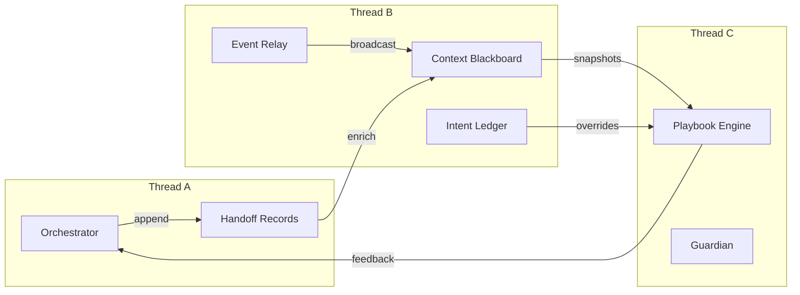

# NeuroLift Multi-Agent Integration Playbook

## Cognitive Alignment Snapshot
- **Josh's working style**: parallel thinker with ADHD; needs modular, visually structured plans and flexible navigation.
- **Design principles**: autonomy-preserving user control, low cognitive overhead, observable agent state, progressive enhancement.
- **Primary objective**: integrate multiple AI agents that coordinate around personal neurotechnology workflows while preserving context and transparency.

---

## Solution Threads Overview
| Thread | Goal | Primary Pattern | When to Use | Upgrade Path |
| --- | --- | --- | --- | --- |
| A | Rapid orchestration with minimal setup | **Composable Orchestrator Hub** | Early prototypes, fast iteration | Emits structured handoff records that Thread B can ingest |
| B | Context-rich collaboration | **Shared Memory + Event Bus** | Multi-modal pipelines, assistive UX | Publishes context slices + intent entries to Thread C guardian |
| C | Long-running, adaptive workflows | **Autonomous Playbooks & Guardians** | Production deployments, safety-critical | Feeds insights back to Thread A via scored playbooks |

Each thread is designed to interlock: start at Thread A for experimentation, layer in Thread B for richer context, and graduate to Thread C when governance needs increase. The upgrade column highlights the artifact that flows forward so Josh can see how each layer composes.

### Inter-thread Memory Flow

When Claude synthesizes the plan, this diagram anchors how artifacts circulate so multi-thread reasoning stays legible.

---

## Thread A – Composable Orchestrator Hub
**Intent**: quick-start environment where a single conductor agent brokers conversations and exposes high-level commands for the user.

### Architectural Sketch
1. **Front Controller**: HTTP/WebSocket boundary that normalizes requests.
2. **Orchestrator Agent**: maintains short-lived session graph and picks specialized agents.
3. **Tool Registry**: declarative map of agent capabilities with affordance metadata (user control labels, sensory modality tags).
4. **Telemetry Hooks**: structured logs for every agent handoff (timeboxed to keep logs ADHD-friendly) captured as `HandoffRecord` instances.

### Trade-offs
- ✅ Fast to build, easy to visualize state transitions.
- ⚠️ Orchestrator becomes a bottleneck if all decisions flow through it.
- 🚧 Requires explicit handoff contracts to avoid context loss (emit a `HandoffRecord` for every dispatch and archive it to the ledger).

### Neurodivergent-friendly Touches
- Provide `// focus` annotations in logs to spotlight key actions.
- Use collapsible UI sections so Josh can zoom into the active subtask without losing the broader outline.

---

## Thread B – Shared Memory + Event Bus
**Intent**: scale to multi-modal, multi-agent collaboration with persistent context snapshots.

### Architectural Sketch
1. **Context Blackboard**: document store (e.g., SQLite or LiteLLM memory) that stores structured `ContextSlice` objects.
2. **Intent Ledger**: append-only register of user decisions and agent interpretations (implemented in `examples/neuroLift/intent_ledger.py`).
3. **Event Bus**: async pub/sub (e.g., Redis Streams or simple in-memory queue) broadcasting state changes.
4. **Agents-as-Listeners**: each agent subscribes to event types it cares about and can append new context slices.
5. **User Agency Layer**: user-facing control panel allowing enable/disable per agent and manual context pinning.

### Trade-offs
- ✅ Enables concurrent agents without central bottleneck.
- ✅ Context snapshots make it easier to rewind or audit.
- ✅ Ledger entries let the user retroactively correct or veto interpretations.
- ⚠️ Requires conflict resolution strategy (last-write wins vs. merge).

### Neurodivergent-friendly Touches
- Visualize context slices as cards that can be stacked, pinned, or muted.
- Offer "focus window" that hides events outside current thread while keeping global timeline accessible.

---

## Thread C – Autonomous Playbooks & Guardians
**Intent**: production-grade workflows with safety rails and adaptive scheduling.

### Architectural Sketch
1. **Playbook Engine**: YAML/JSON-defined state machine describing agent sequences and guard conditions (`examples/neuroLift/playbook_engine.py`).
2. **Guardian Agent**: monitors KPIs, ethical constraints, and user intent drift; can pause/resume playbook.
3. **Adaptive Scheduler**: adjusts cadence based on physiological feedback (e.g., neuro signals) or user overrides.
4. **Audit & Explainability Layer**: provides timeline, rationale snapshots, and re-run capability fed by ledger + capsule diffs.

### Trade-offs
- ✅ High governance and traceability.
- ✅ Easy to share playbooks with collaborators.
- ⚠️ Higher upfront investment; needs continuous validation.

### Neurodivergent-friendly Touches
- Present playbooks as nested checklists with progress markers.
- Allow custom pacing cues (color coding, reminders) to match attention rhythms.
- Surface `TimelineEvent` entries as cards so Josh can replay any step without scrolling through raw logs.

---

## Integration Pathway
1. **Start with Thread A**: implement orchestrator scaffold and modular registry.
2. **Add Thread B features**: integrate shared memory once multiple agents need historical context.
3. **Introduce Thread C selectively**: wrap critical flows (e.g., neurofeedback adjustments) in playbooks with guardian oversight and scoring.

This staged approach keeps cognitive load manageable while allowing iterative expansion.

---

## Key Design Patterns
### 1. Context Capsule
Encapsulates agent context and transitions in a serializable object.
- Supports diffing between capsules.
- Embeds provenance metadata for explainability.
- Provides cursor helpers for thread aware views.

**Implementation Reference**: `examples/neuroLift/context_capsule.py` exposes immutable slices, cursor management, TTL pruning, and serialization helpers.

### 2. Intent Ledger
Append-only ledger of user intents and agent interpretations.
- Supports user overrides and retroactive corrections.
- Helps guardian agent detect drift.
- Scores handoffs to surface weak links in the chain.

**Implementation Reference**: `examples/neuroLift/intent_ledger.py` provides `IntentLedger.record()` and `acknowledge()` so overrides are explicit.

### 3. Elastic Toolchains
Composable sequences of agents/tools that can be rearranged on demand.
- Each step advertises inputs/outputs + optional handoff contract.
- Enables UI affordances for drag-and-drop workflow editing.

**Implementation Reference**: `examples/neuroLift/playbook_engine.py` composes orchestrator calls, ledger checks, and guardian hooks into reusable playbooks.

---

## Open Questions for Claude Synthesis
1. How do we score agent handoffs for quality (latency, accuracy, user satisfaction)?
2. Which physiological signals are available and how noisy are they? (Impacts Guardian thresholds.)
3. Preferred deployment surface (desktop app, web, VR) to tailor neurodivergent-friendly UI patterns.
4. Data residency and compliance constraints for shared memory store.

---

## Next Steps Checklist
- [ ] Choose initial orchestrator stack (FastAPI + asyncio + LiteLLM suggested).
- [ ] Define `ContextCapsule` schema and persistence layer.
- [ ] Build agent registry prototype with affordance metadata.
- [ ] Wire orchestrator dispatch metrics into the intent ledger for transparency.
- [ ] Design UI mock for focus window + context cards + ledger overrides.

---

*This playbook is structured so Claude can weave it into the broader NeuroLift integration framework while keeping Josh oriented and in control.*
